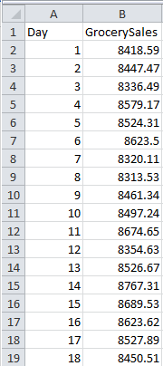
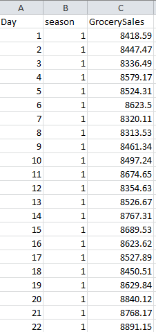

# Grocery-Sales-Forecast-Weekend-Hackathon
Given the daily sales of a grocery shop recorded over a period of almost 2 years, your objective as a data scientist is to build a machine learning model that can forecast the sales for the upcoming 3 months.
## Data at a Glance

     
## Processed Data(Added Season representing months)

# A Description of my Methodology
#### Feature Engineering & Approach
1. Added New columns for the Time series to make our model much standard.
2. Used XGBRegressor for modeling.
#### Tools used
1. Python for programming
2. sklearn and numpy libraries for methodology
3. xgboost library for the model
4. matplotlib and seaborn was used for plotting and analyzing the data
#### Competition Result
Rank: 4th on public LB and 2nd on private LB\
[Link](https://analyticsindiamag.com/grocery-sales-forecast-hackathon-winners/)
